# AlgoNotion Extension

백준(BOJ)에서 맞았습니다!! 뜨면 자동으로 코드를 수집해 Notion 데이터베이스에 저장하는 Chrome 확장입니다.

## 초기 설정 방법

확장 아이콘을 클릭하면 아래와 같은 설정 팝업이 열립니다.

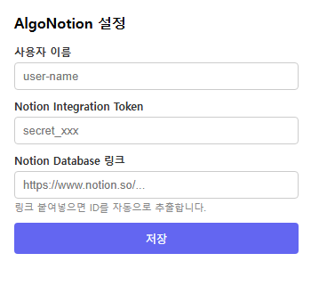

---

### 1. Notion Integration Token 발급

**① Notion에서 저장할 데이터베이스 페이지를 열고 우측 상단 `...` 버튼 클릭**

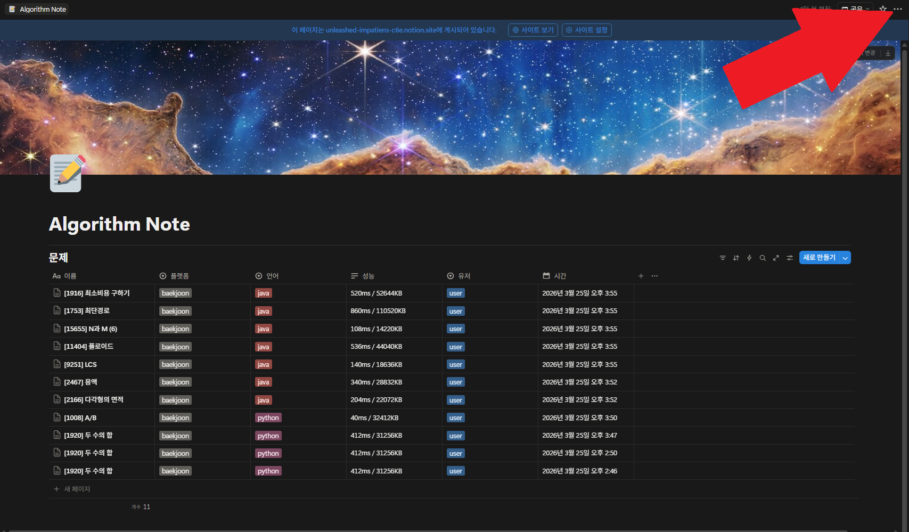

**② `연결` 메뉴 클릭**

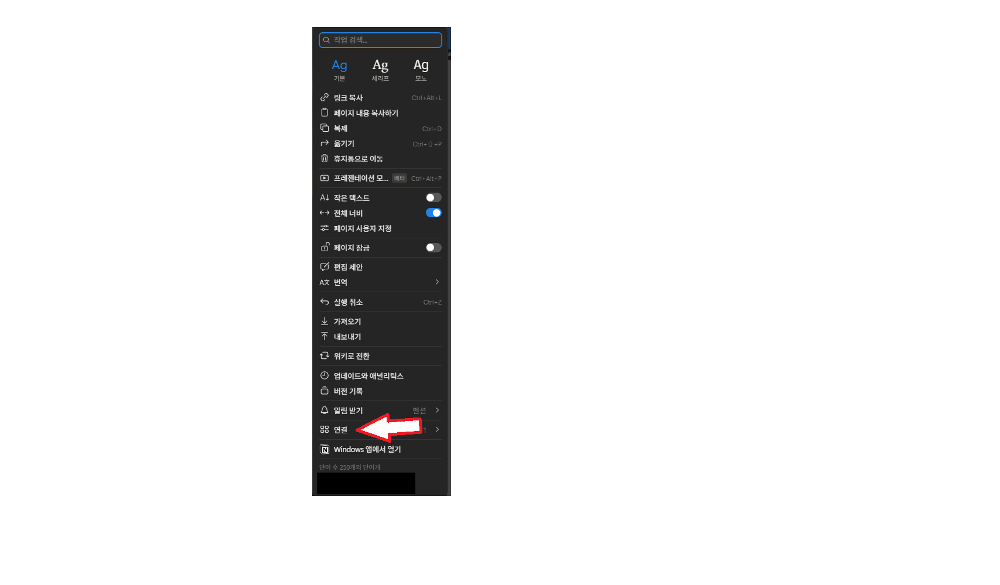

**③ `연결 관리` 클릭**

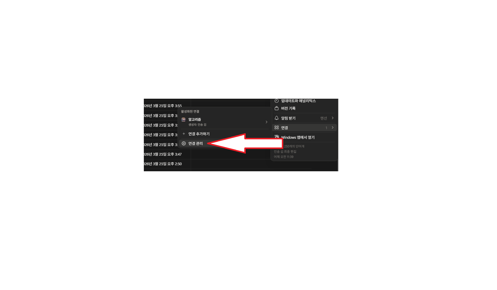

**④ `API 연결 개발 또는 관리` 클릭 → Notion 개발자 페이지로 이동**

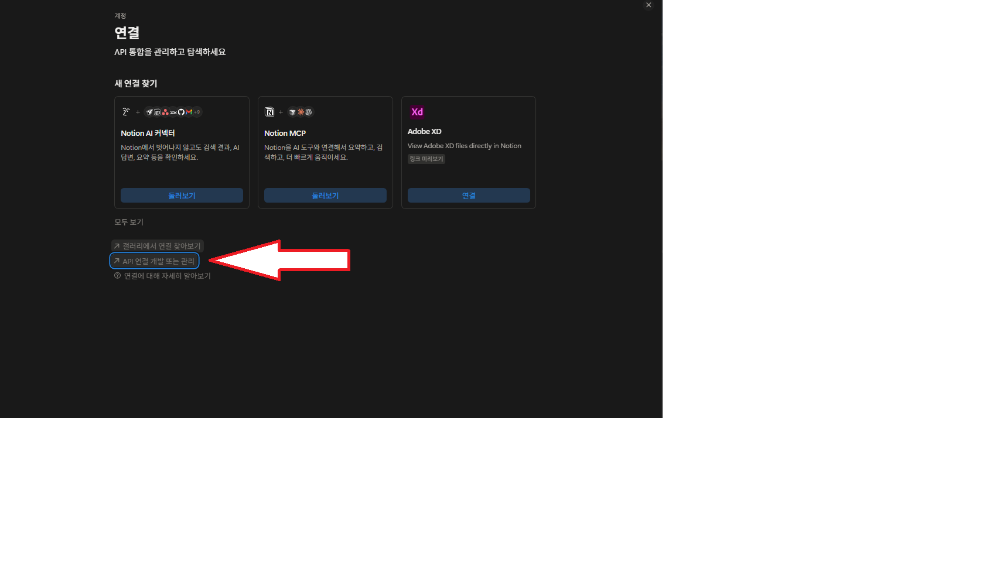

**⑤ `내부 API 통합` → `새 API 통합 만들기` 클릭**

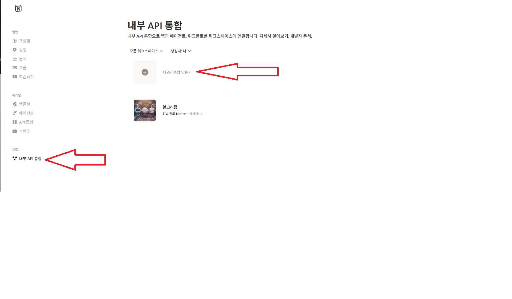

**⑥ 이름 입력 후 AlgoNotion이 있는 워크스페이스 선택 → `생성하기` 클릭**

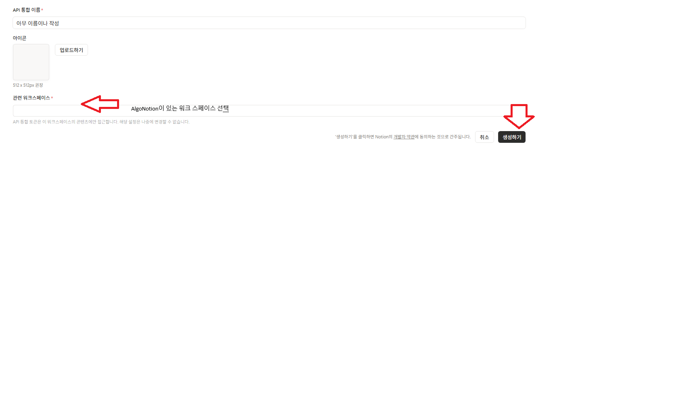

**⑦ `콘텐츠 사용 권한` 탭 → `편집 권한` 클릭**

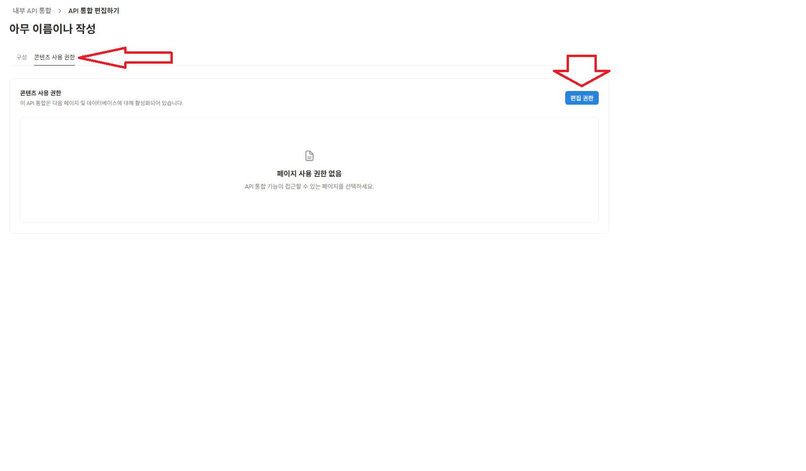

**⑧ Algorithm Note 데이터베이스 선택 후 `저장하기` 클릭**

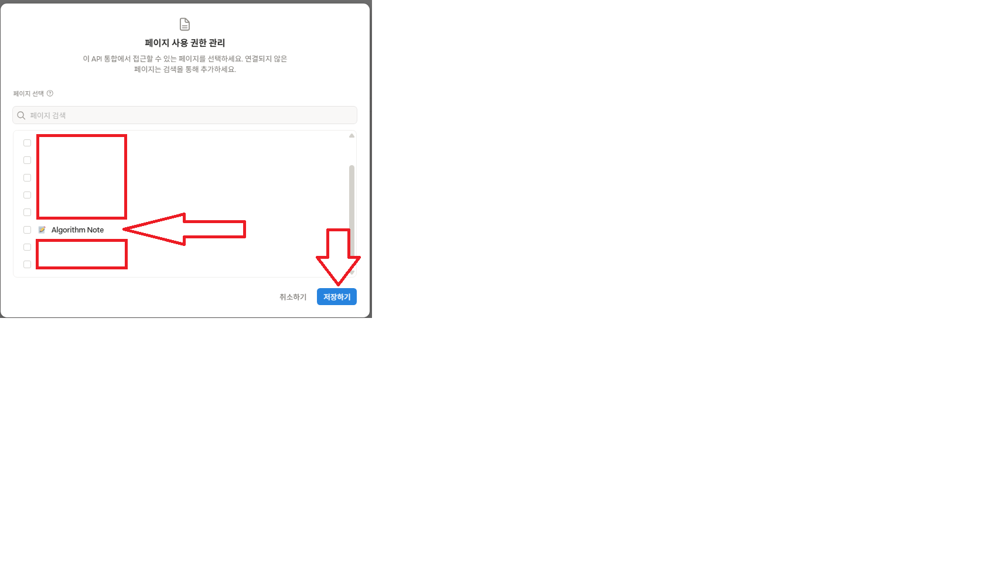

**⑨ `구성` 탭 → `프라이빗 API 통합 시크릿` 복사**

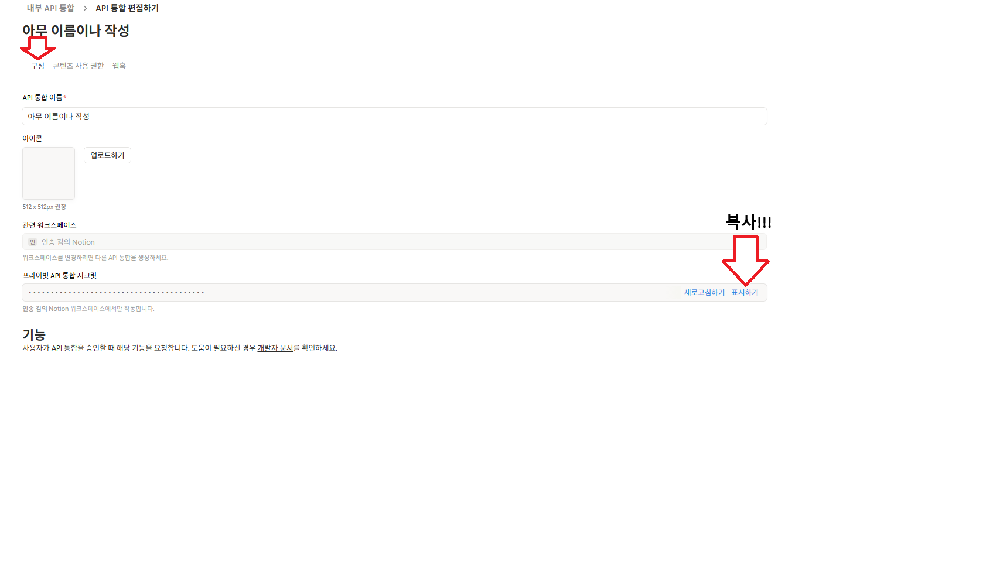

**⑩ 팝업의 `Notion Integration Token` 입력란에 붙여넣기**

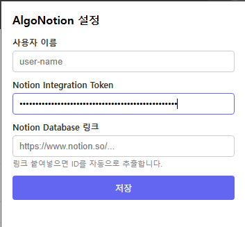

---

### 2. Notion Database 링크 가져오기

**① Notion에서 저장할 데이터베이스 페이지 열기**

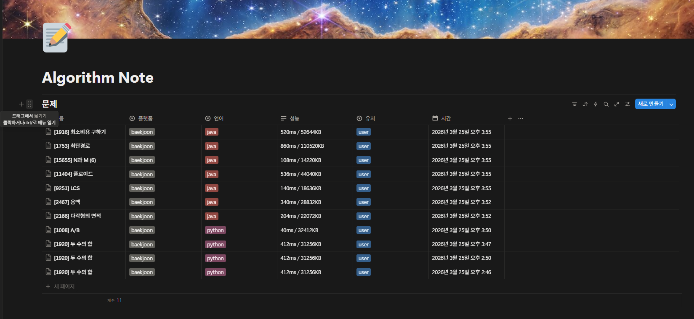

**② 사이드바에서 데이터베이스에 마우스 오버 후 `...` 클릭**

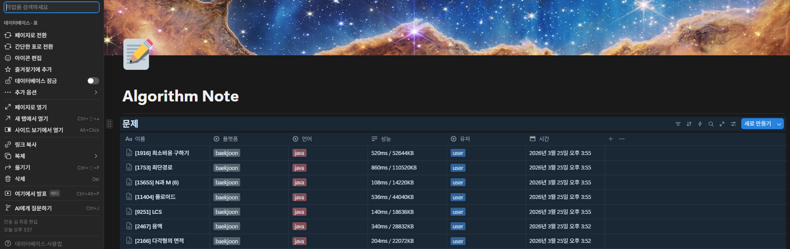

**③ `링크 복사` 클릭**

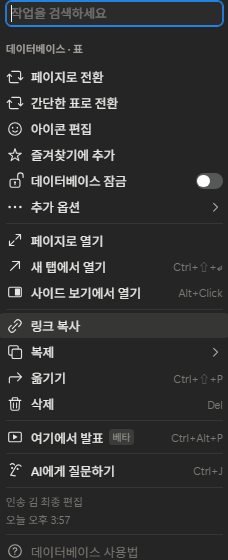

**④ 팝업의 `Notion Database 링크` 입력란에 붙여넣기 → `저장`**

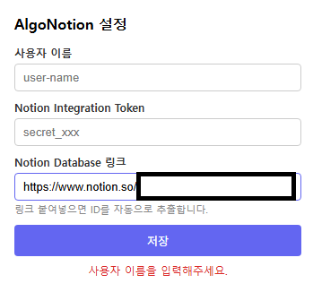

---

## 동작 방식

1. 백준 채점 현황 페이지(`/status`)를 폴링하며 **맞았습니다!!** 행을 감지
2. 해당 제출의 소스 코드를 다운로드
3. [solved.ac](https://solved.ac) API로 문제 제목·티어 보강
4. 백엔드 서버(`/webhook`)로 전송 → Notion에 저장

## 폴더 구조

```
extension/
├── manifest.json               # Manifest V3 설정
├── rules.json                  # declarativeNetRequest 규칙
├── assets/                     # 아이콘 (16/48/128px)
├── background/
│   └── service_worker.js       # 메시지 수신 → solved.ac → 백엔드 전송
├── content/
│   └── baekjoon_content.js     # 채점 현황 감지 + 업로드 버튼 주입
├── options/
│   ├── options.html            # 설정 페이지 UI
│   └── options.js              # 설정 저장/불러오기
└── scripts/
    ├── api_client.js           # solved.ac / 백엔드 API 호출
    ├── language_normalizer.js  # 언어명 정규화
    └── payload_builder.js      # 웹훅 페이로드 조립
```

## 설치 방법

1. 이 레포 클론 또는 ZIP 다운로드
2. Chrome 주소창에 `chrome://extensions` 입력
3. **개발자 모드** 활성화
4. **압축해제된 확장 프로그램을 로드합니다** 클릭 → `extension/` 폴더 선택

## 사용법

1. 백준에서 문제 제출
2. 채점 현황 페이지(`acmicpc.net/status`)로 이동
3. **맞았습니다!!** 옆 **Notion 업로드** 버튼 클릭
4. Notion 데이터베이스에 자동 저장

> 버튼 없이 자동 업로드는 현재 미지원 — 수동 버튼 클릭 필요

## 관련 레포

- [AlgoNotion](https://github.com/AutoSseug/AlgoNotion) — 백엔드 서버

## 기여

[CONTRIBUTING.md](./CONTRIBUTING.md) 참고
